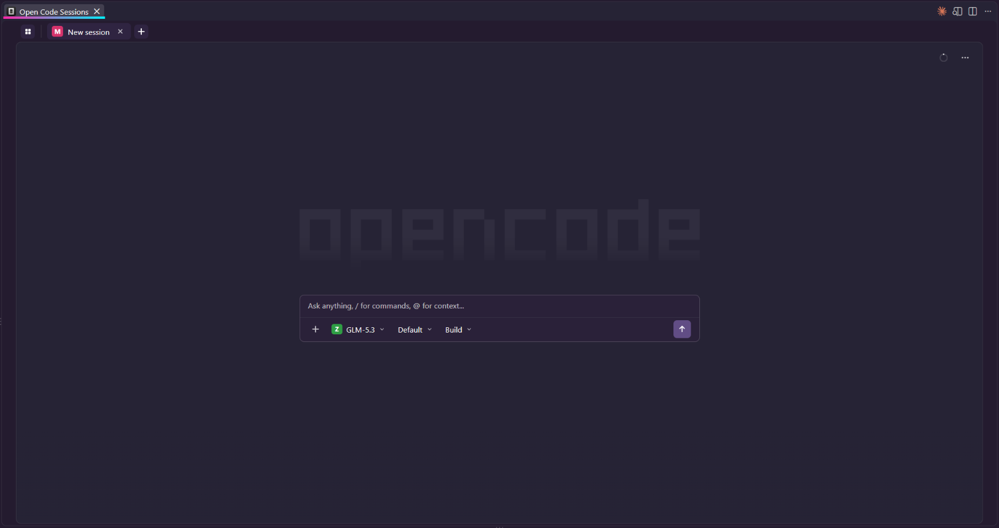

<div align="center">

# VSC OpenCode GUI

**The opencode agent, native in VS Code.**



</div>

The Claude Code extension's UX model — chat in the editor area, command-palette
parity, keyboard-first — running [opencode](https://opencode.ai) underneath.
The extension spawns a headless `opencode serve`; the UI is our own webview app
talking to it. Nothing embedded, nothing patched.

## ✨ Features

- **Chat in the editor** — the agent lives in a tab (`Ctrl/Cmd+Esc`), with a
  sidebar view and session tabs.
- **Projects × sessions home** — every session of every project on one screen;
  clicking a session from another folder opens it there, deep-linked.
- **Sub-agents are sessions** — open a child from its chip, steer it mid-run,
  stop it alone while the parent's turn continues.
- **Notifications, visual and sound** — a tab pulses yellow while its
  session (or any sub-agent under it) waits on you, green when a turn
  finishes in a tab you haven't opened; chimes cover ready, permission,
  and question events.
- **Steer mid-turn** — a prompt sent while the agent works lands at the next
  step boundary, so ongoing work stays steerable.
- **Attachments become real files** — images, PDFs, documents are snapshotted
  to the workspace before the turn starts, so the agent can reuse them on disk.
- **Context & cost ring** — live context-window fill; click for the cost and
  token breakdown.
- **Remote-ready** — SSH, Dev Containers, WSL, Codespaces: everything runs
  workspace-side.

## ⌨️ Keys & Commands

| | |
| --- | --- |
| Toggle Chat | <kbd>Ctrl/Cmd</kbd>+<kbd>Esc</kbd> |

Everything else lives under the **`Open Code:`** prefix in the command palette:
New Session, Show History, Open in Terminal, Show Session Diff, Toggle Context
Breakdown, Manage Models, Restart (also rebuilds a dead chat tab). A built-in
`/todoclear` is injected into the spawned server only — your opencode config
files are never touched.

## ⚙️ Settings

| Setting | Default | What it does |
| --- | --- | --- |
| `opencodeGui.port` | `0` | Fixed server port (`0` = random). Changing it resets webview preferences. |
| `opencodeGui.path` | *(empty)* | Full path to the opencode CLI; empty = use `PATH`. |
| `opencodeGui.exposeToNetwork` | `false` | Pass `--mdns` to the server so other devices can reach it. |
| `opencodeGui.codeGlow` | `false` | Neon-glow rendering for code-block tokens. |
| `opencodeGui.codeCopyModifier` | `alt` | Modifier held to copy small code blocks on click. |
| `opencodeGui.readySound` | `true` | Chime when a turn finishes (1.5 s grace cancels on follow-ups). |
| `opencodeGui.permissionSound` | `true` | Chime on permission asks. |
| `opencodeGui.questionSound` | `true` | Chime on questions. |
| `opencodeGui.stuckToolSeconds` | `300` | Silence before a tool is marked stuck; `0` disables. |
| `opencodeGui.stuckAutoAbortSeconds` | `0` | Silence before auto-interrupt; `0` = manual chip only. |

## 📦 Install

Install from source:

```bash
git clone https://github.com/chinese-room-solutions/vsc-opencode-gui
cd vsc-opencode-gui
make install   # compile, package the .vsix, install — then reload VS Code
```

Requires the [opencode CLI](https://opencode.ai/) where the workspace runs
(remote workspaces: on the remote machine). `make uninstall` removes it.

> ℹ️ On server start, two skills (`oc-task`, `oc-attachments`) are
> installed into your opencode config dir (`~/.config/opencode/skills/`) so
> every session gets sub-agent delegation and attachment reuse.

## 🛠️ Development

```bash
npm install
npm run watch
```

Then open the repo in VS Code and press `F5` for the Extension Development Host.

<details>
<summary>Tests</summary>

`npm test` compiles, runs unit tests, then boots a real VS Code instance for
the lifecycle scenarios: server boot, restart with port reuse, `deactivate()`
freeing the port, uncaught-exception handling, orphan-process checks. Needs
Node ≥ 22.5 and `opencode` + `git` on `PATH`; ~30 s, cleans up after itself.

UI is exercised in a plain browser via `node scripts/ui-rig.js <dir> [port]`
(real server) for Playwright passes. See `AGENTS.md` for the verification bar.

</details>

<details>
<summary>Architecture</summary>

`src/server/` spawns and owns the headless `opencode serve` child (crash
respawn, kill-by-port). `src/webview/app/` is a Preact + signals app; the
extension host (`src/webview/AppHost.ts`) relays every API call and pumps both
SSE streams into the webview as window messages.

</details>

## License

[MIT](LICENSE)
